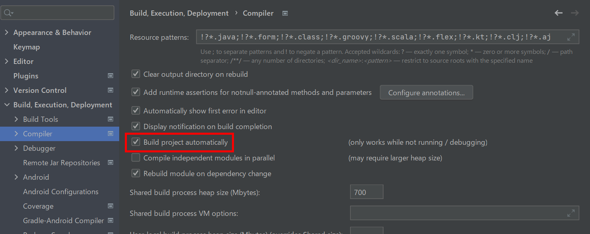
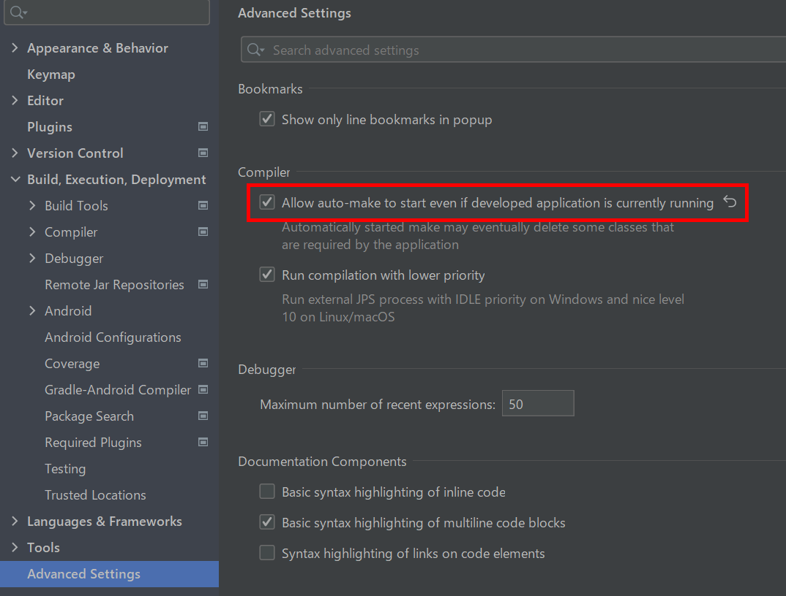
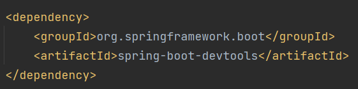

# Spring Boot学習用

## 環境構築

OS：Windows 10  
Amazon Corretto：21  
Maven：3.6.3

### ソフトウェアのインストール
#### Amazon Correttoインストール
以下ページの赤枠リンクからインストーラーをダウンロードする。
https://docs.aws.amazon.com/corretto/latest/corretto-21-ug/downloads-list.html


インストーラーを起動し、画面の指示に従いインストールを実行。

インストール後、以下の環境変数がセットされていることを確認。  
値が設定されていなければ追加する。  
　JAVA_HOME  
　　インストールディレクトリが値にセットされていること  
　PATH  
　　値に「インストールディレクトリ/bin」が含まれていること  

コマンドプロンプトを起動し、以下のコマンドを実行し、JDKのバージョン等の情報が帰ってくることを確認。  
　java --version  

```
openjdk 21.0.2 2024-01-16 LTS
OpenJDK Runtime Environment Corretto-21.0.2.13.1 (build 21.0.2+13-LTS)
OpenJDK 64-Bit Server VM Corretto-21.0.2.13.1 (build 21.0.2+13-LTS, mixed mode, sharing)
```

<br />

### Spring Bootプロジェクト作成
#### Spring Initializerを使ってプロジェクトを作成
Spring Initializerのサイトにアクセス。  
https://start.spring.io/

作成するSpring Bootプロジェクトの各種設定は以下。  
　Project：Maven  
　Language：Java  
　Spring Bootのバージョン：最新版を選択  
　Group、Artifact：任意の名前を入力  
　Packaging：Jar  
　Javaのバージョン：21  
　Dependencies：Spring Webを選択  

上記設定のうえ、GENERATEをクリックし、zipファイルをダウンロード。


zipファイルを展開し、中にあるフォルダを所定のディレクトリに配置する。  

<br />

IntelliJを開き、Open→配置したフォルダを選択

#### IntelliJで使用するJDKをAmazon Correttoに設定
プロジェクトを開いた後、JDKのセットアップができていない旨のメッセージが表示される場合がある。  
その場合、メッセージと共に表示されている「Setup JDK」をクリックし、  
Amazon Correttoインストールディレクトリを選択することで問題は解消される。

<br />

## Spring Boot Actuator
Spring Bootアプリケーションの監視と管理を支援するための拡張機能。
REST APIでこれらの情報を提供する。  
以下のライブラリをpom.xmlに追加することで利用できる。 
```pom.xml
<dependency>
	<groupId>org.springframework.boot</groupId>
	<artifactId>spring-boot-starter-actuator</artifactId>
</dependency>
```
APIへは以下のURLでアクセスする。  
　https://<アプリのURL>/actuator/<エンドポイント名>

デフォルトではhealthエンドポイントのみ公開される。  
application.propertiesで必要に応じて公開するエンドポイントを指定する。
```pom.xml
management.endpoints.web.exposure.include=health,info
management.info.env.enabled=true
```


### REST APIの種類
health：アプリケーションのヘルスチェックに関する情報を提供  
info：アプリケーションの各種情報を提供。提供する情報はapplication.propertiesで定義する。  
mappings：アプリケーションのREST APIのリストを提供

<br />

## 開発環境の自動リロード設定。
Spring Bootでは、開発環境で実装している際、実装後の状態に開発環境をリロードすることができる。  
以下に、IntelliJで自動リロードするための設定方法を記載する。  

### IntelliJの設定変更
File > Settings > Build, Execution, Deployment > Compiler  
以下にチェックを入れ、「Apply」をクリックする。  
　Build project automatically


同じ設定画面にて、Advanced Settingsに遷移し、以下にチェックを入れ、「Apply」をクリックする。  
　Allow auto-make to start even if developed application is currently running.


### ライブラリをpomに追加
以下のライブラリをpomに追加し、pomをリロードする。  
　spring-boot-devtools

